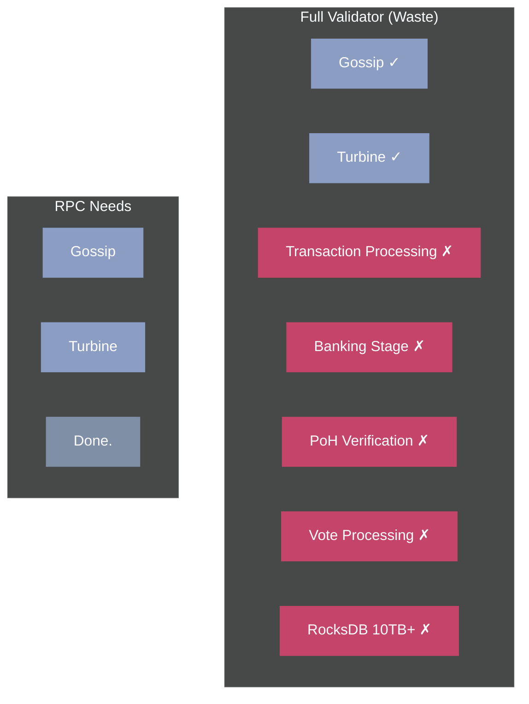
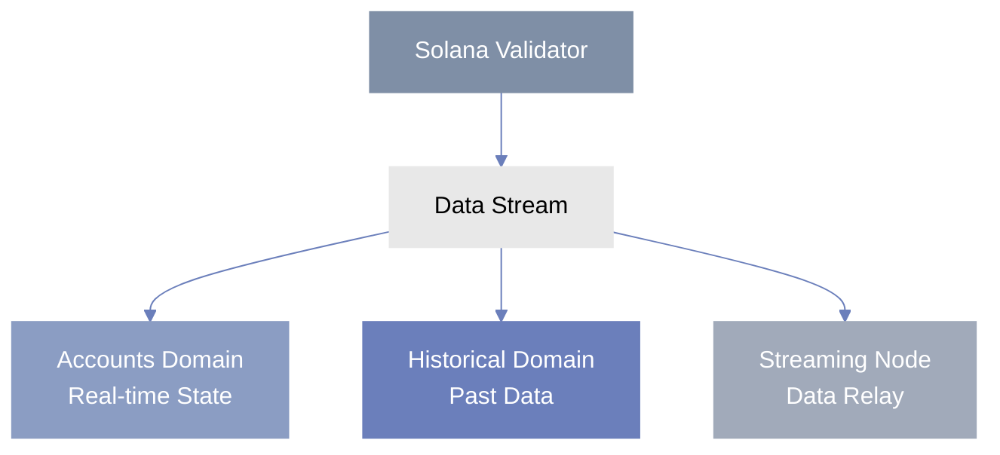
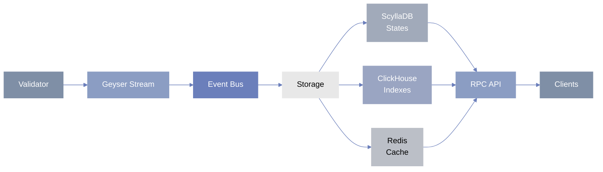
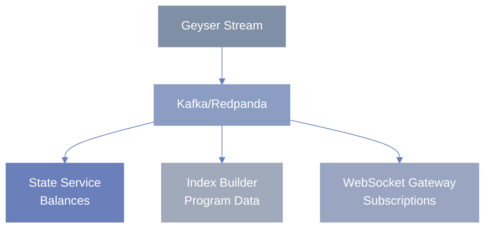
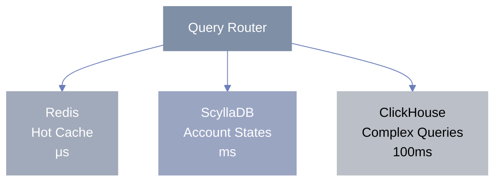
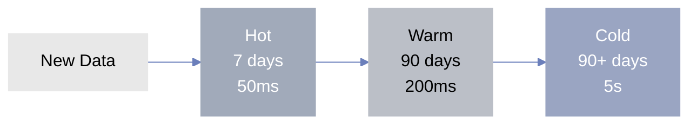
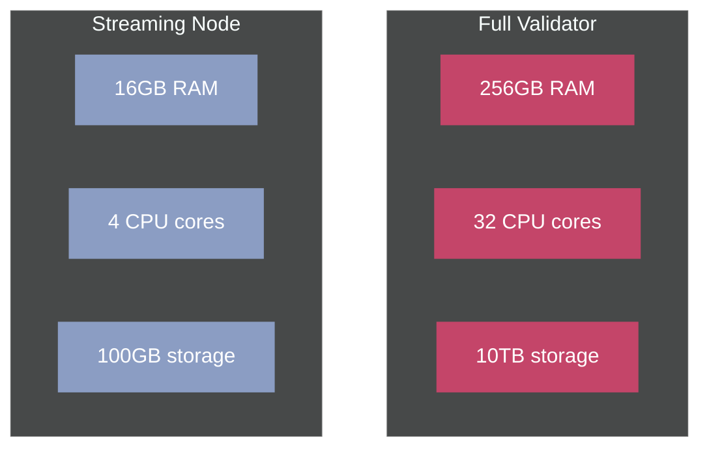

<style>
.slidev-layout h1 {
  color: #14F195;
}
.slidev-layout h2 {
  color: #9945FF;
}
.highlight {
  color: #14F195;
  font-weight: bold;
}
.problem {
  color: #FF6B6B;
  font-weight: bold;
}
.solution {
  color: #4ECDC4;
  font-weight: bold;
}
pre {
  background: #1a1a1a !important;
}
</style>

# <span class="">RPCv2 and Solana's Data Overhaul</span>

## Fixing the $70k/month problem

<div class="text-2xl mt-8 mb-8">
  <span class="">How Solana is rebuilding its data access layer from scratch</span>
</div>

**by Vivek**

**Technical Weekly Sharing | 24/09/2025**

---

# The Current Reality

## What it costs to run Solana RPC today

<div class="grid grid-cols-2 gap-8 mt-8">
<div>

### Monthly Costs
- **BigTable Storage:** $50k
- **Compute:** $15k
- **Network:** $5k
- **Total:** <span class="problem">$70k/month</span>

</div>
<div>

### Hardware Requirements
- **256-512GB RAM**
- **32-64 CPU cores**
- **10-20TB NVMe**
- **10Gbps+ network**

</div>
</div>

<div class="mt-8 text-xl">

**Result:** Only 3-4 providers can afford to serve historical data

</div>

---

# What's Actually Breaking

## Real problems RPC providers face daily

<div class="mt-8">

### 1. getProgramAccounts Timeouts
- Raydium queries take **30+ seconds** or timeout completely
- Some providers run **dedicated RPCs** just for specific programs

### 2. Database Explosion
- **2.3 trillion** transaction signatures stored
- **1TB of new data per day**
- Storage growing exponentially

### 3. Monolithic Architecture
- Can't use cheaper storage (locked to BigTable)
- Can't optimize specific queries
- Can't scale components independently

</div>

---

# The Waste Problem

## Running a full validator just to stream data



<div class="mt-8 text-xl">

**90% of resources wasted** on unnecessary processing

**3,200 non-voting validators** clogging the gossip network

</div>

---

# RPCv2: The Solution

## Split the problem into three specialized services



<div class="mt-8 text-xl text-center">

Each service optimized for its specific job

</div>

---

# Accounts Domain (What We're Building)

## Serving real-time account data efficiently

<div class="mt-8">

### Current Problems
- Account queries timeout under load
- No proper indexing for program accounts
- Geyser plugins crash validators

### Our Solution Architecture



### Key Improvements
- <span class="solution">100k+ RPS target</span> (vs current ~1k)
- Sub-200ms latency for most queries
- Program-aware indexing (no more full scans)

</div>

---

# How Accounts Domain Works

## Technical approach without the complexity

<div class="mt-8">

### 1. Single Producer, Multiple Consumers



### 2. Smart Storage Choices



### 3. No More Timeouts
- Pre-built indexes for token queries
- Pagination for large results  
- Query cost estimation & limits

</div>

---

# Historical Domain (Considering)

## Making historical data affordable

<div class="grid grid-cols-2 gap-8 mt-8">

<div>

### Current: BigTable Lock-in
- **$70k/month** for storage
- Vendor lock-in to Google
- No flexibility
- 5-30 second queries

</div>

<div>

### Proposed: Pluggable Storage
- **$10k/month** with ClickHouse
- Any database backend
- Parquet for cold storage
- 50-200ms queries

</div>

</div>

<div class="mt-8">

### Smart Tiering Strategy



**85% cost reduction** while improving performance

</div>

---

# Streaming Node (Can Apply)

## Lightweight alternative to full validators

<div class="mt-8">

### Resource Comparison: Full Validator vs Streaming Node



### How It Works
1. **Receive shreds** from gossip/turbine
2. **No processing** - just relay data
3. **1:N fanout** to multiple consumers
4. **Stateless** - instant recovery from crashes

### Network Impact
- **63% reduction** in gossip traffic
- Aligns with Alpenglow goals
- Enables more RPC providers

</div>

---

# Implementation Strategy

## 24-week development timeline

```mermaid
%%{init: {'theme':'dark', 'themeVariables': { 'cScale0': '#8B9DC3', 'cScale1': '#6B7FBB', 'cScale2': '#7F8FA6', 'primaryColor': '#8B9DC3', 'primaryTextColor': '#ffffff', 'primaryBorderColor': '#8B9DC3', 'lineColor': '#6B7FBB', 'sectionBkgColor': '#1a1a1a', 'altSectionBkgColor': '#2d2d2d'}}}%%
gantt
    title 24-Week Plan
    dateFormat  X
    axisFormat Week %s

    section Foundation
    Geyser Pipeline      :0, 8
    ScyllaDB Storage     :0, 8

    section Indexing  
    ClickHouse Setup     :8, 16
    Token Indexes        :8, 16

    section Production
    Security & Tuning    :16, 24
    Deployment           :16, 24
```



---

# Phase 1: Foundation
## Weeks 1-8: Core Infrastructure

<div class="mt-8 grid grid-cols-2 gap-8">

<div>

### ✓ Geyser Ingestion Pipeline
- Stream account updates from validator
- Handle 1M+ updates per second
- Reliable message delivery

### ✓ Basic Account Storage
- ScyllaDB cluster setup
- Account state persistence
- Fast key-value lookups

</div>

<div>

### ✓ Core RPC Endpoints
- getAccountInfo
- getBalance
- getTokenAccountsByOwner
- Basic subscription support

### ✓ WebSocket Subscriptions
- Real-time account updates
- Program account monitoring
- Connection management

</div>

</div>

---

# Phase 2: Indexing
## Weeks 9-16: Query Optimization

<div class="mt-8 grid grid-cols-2 gap-8">

<div>

### ClickHouse Integration
- Columnar storage for analytics
- Complex query support
- Materialized views

### SPL Token Indexes
- Owner → tokens mapping
- Mint → holders mapping
- Balance-based sorting

</div>

<div>

### getProgramAccounts Optimization
- Pre-built program indexes
- Filter validation
- Pagination support

### Performance Targets
- **100k+ RPS** sustained
- **Sub-200ms** query latency
- **99.9%** uptime guarantee

</div>

</div>

---

# Phase 3: Production
## Weeks 17-24: Hardening & Deployment

<div class="mt-8 grid grid-cols-2 gap-8">

<div>

### Security & Reliability
- DDoS protection
- Rate limiting per client
- Input validation
- Error handling

### Performance Optimization
- Connection pooling
- Cache warming
- Query optimization
- Resource monitoring

</div>

<div>

### Deployment & Documentation
- Docker containerization
- Kubernetes manifests
- Monitoring dashboards
- Operator runbooks

### Open Source Release
- **AGPL license**
- No vendor lock-in
- Community contributions welcome

</div>

</div>

---

# Expected Impact

## What this means for Solana

<div class="grid grid-cols-2 gap-8 mt-8">

<div>

### For RPC Providers
- **94% cost reduction**
- 10-second startup (vs 1 hour)
- Run 10x more nodes for same cost
- Focus on business, not infrastructure

</div>

<div>

### For Developers
- **No more timeouts**
- Sub-second responses
- Reliable websockets
- Better documentation

</div>

</div>

<div class="mt-8">

### For the Network
- Less gossip congestion
- More RPC providers (lower barriers)
- Better decentralization
- Innovation enablement

</div>

---

# Performance Gains

## Query speed improvements

<div class="mt-8">

| Query Type | Current | RPCv2 Target | Improvement |
|------------|---------|--------------|-------------|
| getTransaction | 500ms-2s | 20-50ms | <span class="accent-purple">**10-40x**</span> |
| getBlock | 2-10s | 100-500ms | <span class="accent-purple">**10-20x**</span> |
| getProgramAccounts | 5-30s | 50-200ms | <span class="accent-purple">**100-150x**</span> |
| Token queries | 1-5s | 50-100ms | <span class="accent-purple">**20-50x**</span> |

</div>

<div class="mt-12 text-center">

**Most queries under 200ms** vs current 5-30 second timeouts

</div>

---

# Cost Savings

## Monthly infrastructure costs

<div class="mt-8">

| Component | Current | RPCv2 | Monthly Savings |
|-----------|---------|-------|---------|
| Historical Storage | $70,000 | $10,000 | <span class="accent-green">**$60,000**</span> |
| Streaming Nodes | $3,000 | $200 | <span class="accent-green">**$2,800**</span> |
| **Total** | **$73,000** | **$10,200** | <span class="accent-green">**$62,800**</span> |

</div>

<div class="mt-12 grid grid-cols-2 gap-8 text-center">

<div>
### Current: BigTable Lock-in
- Expensive managed service
- No flexibility in storage
- Exponential cost growth
</div>

<div>
### RPCv2: Smart Tiering
- Commodity hardware
- Pluggable storage backends  
- Cost scales linearly
</div>

</div>

---

# Technical Challenges

## Problems we're solving

<div class="mt-8">

### 1. Fork Handling
- **Challenge:** Solana has complex fork scenarios
- **Solution:** Track bank_hash lineage, 300-slot reorg buffer

### 2. Data Consistency
- **Challenge:** Multiple validators, different views
- **Solution:** Byzantine fault tolerance, 2/3 consensus for finalization

### 3. Scale Without Scanning
- **Challenge:** Programs with millions of accounts
- **Solution:** Pre-built indexes, query cost estimation

### 4. WebSocket Reliability
- **Challenge:** Connections drop, events get lost
- **Solution:** Resume tokens, event replay, dedupe by client

</div>

---

# Why This Matters

## The bigger picture

<div class="mt-8">

### Current State
- RPC is the **biggest bottleneck** for Solana apps
- Costs are **unsustainable** as volume grows
- Only big players can afford infrastructure

### With RPCv2
- **Any developer** can run RPC services
- **Innovation** isn't blocked by infrastructure
- Solana can **actually scale** to millions of TPS

### Timeline
- **Applications:** Open until Oct 10, 2025
- **Completion:** March 31, 2026
- **Maintenance:** 1-year grants after launch

</div>

<div class="mt-8 text-center text-xl">

This isn't just optimization - it's **enabling Solana's next phase**

</div>

---

# Our Approach

## What we're building specifically

<div class="mt-8">

### Accounts Domain Architecture
```
Yellowstone gRPC → Event Streaming → Specialized Storage
       ↓              (Kafka)              ↓
  Normalized                        ScyllaDB + ClickHouse
  Events                           + Redis Cache
```

### Key Design Decisions
- **Producer/Consumer pattern** for scalability
- **Event sourcing** for replay capability  
- **Pluggable storage** to avoid lock-in
- **Program-aware indexes** for performance

### Why We're Different
- Built specifically for Solana's unique challenges
- Learning from Alpamayo (historical) limitations
- Production-tested patterns from existing RPCs
- Open source from day one

</div>

---

# Questions?

## Let's discuss

<div class="mt-12 text-center">

### Key Takeaways

1. Current RPC costs **$70k+/month** and frequently fails

2. RPCv2 splits into **3 specialized services**

3. Expected **85%+ cost reduction** and **100x performance**

4. **Open source** with sustainable funding model

5. Makes Solana RPC **accessible to everyone**

</div>

<div class="mt-12 text-xl text-center">

**Contact:** @vivek

**RFPs:** Available on Solana Foundation site

</div>

